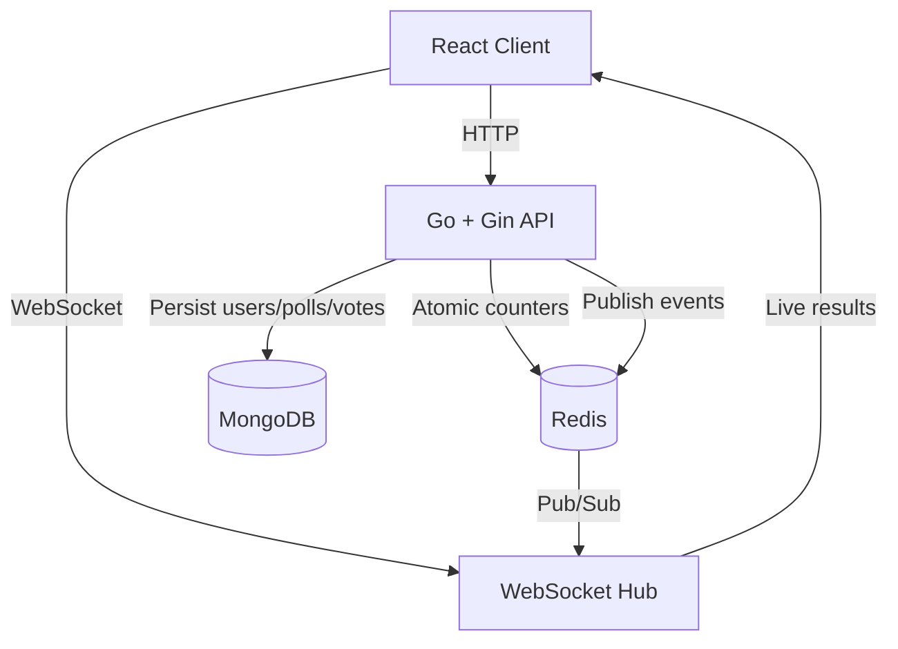

# LivePoll

Create. Share. Vote. Watch it happen live.

Real-time polling: a creator makes a poll, shares one link, and everyone who opens
that link sees vote counts and percentages update instantly — no refresh, no polling
loop, just a WebSocket fed by Redis Pub/Sub.

## Demo

_Add your live URL here once deployed (see "Deploying to production" below)._

```
Live Application:  https://...
Backend API:       https://...
Repository:        https://github.com/Guna-garan/Live_Polling-
```

## Overview

LivePoll has two kinds of users. A **creator** signs up, logs in, and creates a poll
with 2–10 options and an optional expiration. A **voter** needs no account — they
open the shared link, pick an option, and watch results update live, including their
own vote, as everyone else votes.

## Features

- Email/password auth with hashed passwords and an HttpOnly session cookie
- Poll creation, dashboard, closing, deletion — all ownership-checked server-side
- Anonymous voting with a browser-local voter ID, duplicate-vote protection enforced
  by a unique MongoDB index (not just the frontend)
- Real-time results over WebSockets, backed by Redis atomic counters and Pub/Sub
- Automatic reconnect with backoff + resync if the connection drops
- Poll expiration enforced server-side
- Shareable link + QR code
- Redis counters rebuild from MongoDB automatically if Redis loses state

## Tech Stack

| Layer     | Technology                              |
|-----------|------------------------------------------|
| Frontend  | React, Vite, React Router                |
| Backend   | Go, Gin, REST + WebSockets                |
| Database  | MongoDB (source of truth)                |
| Realtime  | Redis (atomic counters + Pub/Sub)         |

## Architecture



## Realtime Architecture

```
Vote request
     |
     v
Validate poll is active, not expired, option exists
     |
     v
Insert vote into MongoDB (unique index on pollId+voterId rejects duplicates)
     |
     v
Redis: HINCRBY poll:{pollId}:results {optionId} 1
     |
     v
Redis: PUBLISH poll:{pollId}:updates {"type":"poll.results.updated", ...}
     |
     v
Go server's single subscriber for that poll receives the event
     |
     v
Poll hub broadcasts the message to every connected WebSocket client
     |
     v
React updates the bars — no refresh
```

If a vote fails validation (duplicate, invalid option, closed/expired poll), it
never reaches the Redis step — the Mongo write is the gate, so Redis counts can
never drift ahead of persisted truth. If Redis restarts and loses its counters,
they're rebuilt from MongoDB on startup and lazily on first read of a poll whose
Redis hash is missing.

## Data Model (MongoDB)

**users** — `email` (unique, lowercased), `passwordHash`, timestamps.

**polls** — `creatorId`, `question`, `options[{id, text}]`, `status`
(`active`/`closed`), `expiresAt`, timestamps.

**votes** — `pollId`, `optionId`, `voterId`, `createdAt`. Unique compound index on
`(pollId, voterId)` — this is the actual duplicate-vote guard, enforced by the
database, not just application code.

Indexes: `users.email` (unique), `polls.creatorId`, `votes.pollId`,
`votes.pollId + votes.voterId` (unique).

## Redis Design

- `poll:{pollId}:results` — a hash of `optionId -> count`, updated with `HINCRBY`
  and read with `HGETALL`.
- `poll:{pollId}:updates` — a Pub/Sub channel. Published message:

```json
{
  "type": "poll.results.updated",
  "pollId": "67abc123",
  "results": { "react": 43, "vue": 18, "angular": 11 },
  "totalVotes": 72,
  "timestamp": "2026-09-18T10:00:00Z"
}
```

## Authentication

Signup/login issue a JWT stored in an **HttpOnly, Secure, SameSite** cookie — never
in frontend-accessible storage. Every protected endpoint re-derives the user from
that cookie server-side; the frontend never sends (and the backend never trusts) a
`creatorId` in the request body.

## Security

- Passwords hashed with bcrypt, never stored or logged in plaintext
- All input validated server-side (frontend validation is UX only)
- Ownership checked server-side on every poll mutation
- CORS restricted to `FRONTEND_URL`
- Secrets read only from environment variables — nothing hardcoded
- Rate limiting on `/signup`, `/login`, `/vote`
- Login errors don't reveal whether the email or the password was wrong
- WebSocket messages size-limited; disconnected clients cleaned up; no per-client
  Redis connections (one shared subscription per poll)

## Voter Identity — an honest caveat

Anonymous voters are identified by a `crypto.randomUUID()` stored in
`localStorage`. This is a **lightweight** anonymous-voting mechanism, not strong
identity verification — clearing localStorage or switching browsers lets someone
vote again. It stops casual double-voting via the UI, backed by a real unique
database index, but it is not fraud-proof. Don't use this for anything where that
matters.

## Local Setup

Requirements: Go 1.22+, Node 18+, Docker (for local Mongo/Redis).

```bash
# 1. Start MongoDB + Redis locally
docker compose up -d

# 2. Backend
cd backend
cp .env.example .env      # defaults already point at the local containers
go mod tidy
go run ./cmd/server

# 3. Frontend (in a second terminal)
cd frontend
cp .env.example .env
npm install
npm run dev
```

Open http://localhost:5173.

> This project was developed in a network-restricted sandbox that could reach npm,
> but not the Go module proxy — the frontend was fully built and its test suite run
> there; the backend's dependency graph was reviewed and hand-verified for syntax
> and consistency but `go build` itself needs to be run somewhere with normal
> internet access (any laptop or CI runner), where `go mod tidy && go build ./...`
> works with no special configuration.

## Environment Variables

**backend/.env**

| Variable          | Meaning                                              |
|--------------------|-------------------------------------------------------|
| `PORT`             | HTTP port (default 8080)                              |
| `APP_ENV`          | `development` or `production`                         |
| `MONGO_URI`        | MongoDB connection string                              |
| `MONGO_DATABASE`   | Database name                                          |
| `REDIS_URL`        | Redis connection string                                 |
| `JWT_SECRET`       | Required in production — generate with `openssl rand -base64 32` |
| `FRONTEND_URL`     | Used for CORS and building shareable links              |

**frontend/.env**

| Variable        | Meaning                          |
|------------------|-----------------------------------|
| `VITE_API_URL`   | Backend base URL (`https://...` in production) |
| `VITE_WS_URL`    | Backend WebSocket base URL (`wss://...` in production) |

## API Documentation

```
POST   /api/auth/signup
POST   /api/auth/login
POST   /api/auth/logout
GET    /api/auth/me

POST   /api/polls              (auth required)
GET    /api/polls              (auth required — creator's own polls)
GET    /api/polls/:id          (public)
PATCH  /api/polls/:id          (auth required, owner only)
DELETE /api/polls/:id          (auth required, owner only)

POST   /api/polls/:id/vote     (public)
GET    /api/polls/:id/ws       (WebSocket upgrade, public)

GET    /health
```

## Testing

```bash
# Backend
cd backend
go test ./...

# Frontend
cd frontend
npm test
```

Backend tests cover signup/login validation, poll ownership and validation, a
concurrent-voting test (20 simultaneous votes from the same voter, exactly one
should succeed), and Redis atomic-increment/Pub-Sub behavior (these skip cleanly
if no test Mongo/Redis instance is configured, rather than failing the suite).
Frontend tests cover percentage math, the voter-ID utility, and the results/voting
UI.

## Deploying to production

This is the part that needs *your own* accounts — I can't create these for you,
and you should never paste their credentials into a chat (with me or anyone else).
Every value below goes straight into your own `.env` file or your hosting
provider's own dashboard.

**1. MongoDB Atlas** (free tier is fine)
   - Create a cluster, a database user, and allow network access from anywhere
     (`0.0.0.0/0`) or your backend host's IP.
   - Copy the connection string — this is your `MONGO_URI`.

**2. Redis — Upstash or Redis Cloud** (free tier is fine)
   - Create a database, copy its connection URL — this is your `REDIS_URL`.

**3. Backend — Render, Railway, or Fly.io**
   - Point it at `backend/` with `Dockerfile` as the build.
   - Set environment variables in *that provider's dashboard*: `MONGO_URI`,
     `MONGO_DATABASE`, `REDIS_URL`, `JWT_SECRET` (generate with
     `openssl rand -base64 32`), `APP_ENV=production`, `FRONTEND_URL` (set this
     after step 4, once you know the frontend's URL).
   - Deploy. Note the resulting HTTPS URL.

**4. Frontend — Vercel, Netlify, or Cloudflare Pages**
   - Point it at `frontend/`, build command `npm run build`, output `dist`.
   - Set `VITE_API_URL` to the backend's HTTPS URL from step 3, and
     `VITE_WS_URL` to the same host with `wss://` instead of `https://`.
   - Deploy. Note the resulting URL.

**5. Close the loop**
   - Go back to the backend provider and update `FRONTEND_URL` to the frontend's
     real URL from step 4, then redeploy the backend so CORS allows it.

**6. Verify the realtime demo end-to-end** (spec section 51)
   - Open the same poll in two browsers (or one browser + one phone).
   - Vote from one — the other should update within a second, no refresh.

## Pushing this project to your GitHub repo

From this project's root directory, on your own machine:

```bash
git init
git add .
git commit -m "Initial LivePoll implementation"
git branch -M main
git remote add origin https://github.com/Guna-garan/Live_Polling-.git
git push -u origin main
```

Git will prompt you to authenticate with GitHub (browser login or a personal
access token you enter locally) — that credential never needs to touch this chat.

## Challenges & Tradeoffs

- **Concurrent vote increments**: a naive read-then-write counter races under
  concurrent votes. `HINCRBY` is used instead because Redis executes it as a single
  atomic operation, so no lock or transaction is needed on the hot path.
- **One Redis subscription per poll, not per client**: with many viewers on one
  poll, a naive per-client Redis subscription wastes connections. The hub keeps a
  single shared subscriber per poll and fans out to all its WebSocket clients.
- **MongoDB as source of truth, Redis as accelerator**: Redis is not treated as
  durable storage — votes are always persisted to MongoDB first, and Redis state
  is fully reconstructible from it.

## Future Improvements

- Multi-select / ranked-choice polls
- Poll results export (CSV)
- OAuth login options
- Per-poll voter analytics dashboard for creators
